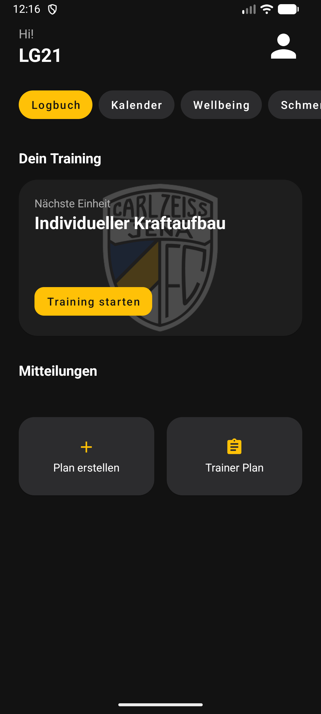
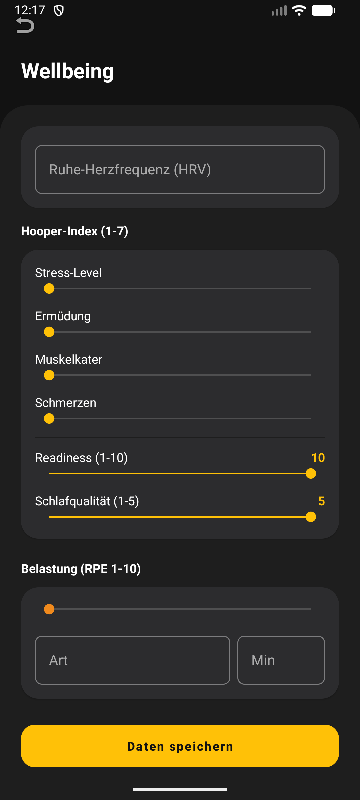
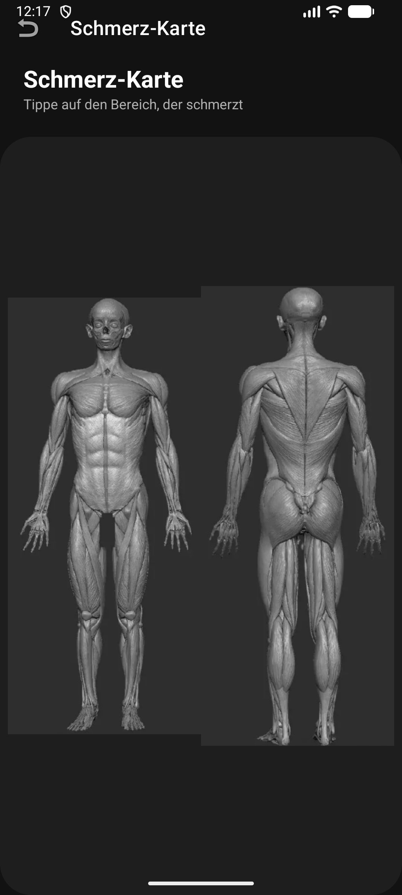

# Athletik-Monitoring-App (Prototyp)

**Android-App (Java), die die athletischen und trainingsrelevanten Bausteine rund um den Fußball in einer Anwendung bündelt — Load-Monitoring, Wellness, Verletzungs-/Schmerzerfassung, Risiko-Ampel, Polar-Auswertung und Trainer-Spieler-Kommunikation.**

Prototyp aus dem M.Sc. *Medical & Sports Technologies* (MCI Innsbruck), entstanden aus der Praxis als Athletiktrainer im Nachwuchsleistungszentrum.

---

## Idee

Im Trainingsalltag ist die Softwarelandschaft zersplittert: für Wellness, Krafttraining, Reha und Tracking-Werte gibt es je eine eigene App — oder gar keine. Das macht den Überblick schwer. Diese App verfolgt einen anderen Ansatz: **alle athletischen Teilbereiche in einer „Solution"**.

Ursprung war ein einfacher Gedanke — ein Athletiktrainer will einen Übungskatalog, aus dem sich Übungen für bestimmte Trainingsziele und Verletzungsbilder individuell und über die Zeit anpassen lassen. Daraus wuchs schrittweise das Performance-Tracking und die Wellness-Erfassung dazu. Ziel ist ein Prototyp, der zeigt, wie sich die athletischen Bausteine eines NLZ- oder Profi-Setups sinnvoll in einer Anwendung zusammenführen lassen.

> Bewusst ein **Prototyp / Proof of Concept**, keine fertig ausgelieferte App.

## Roter Faden: von der ML-Vorhersage zur App

Die **Verletzungs-Risiko-Ampel** (grün / gelb / rot) setzt den interpretierbaren Entscheidungsbaum aus meinem Projekt **[injury-forecaster](https://github.com/LGURI/injury-forecaster)** direkt in der App um: aus Vorverletzung, Readiness und Schlafqualität wird pro Spieler:in ein Risiko-Flag berechnet und dem Trainer im Dashboard angezeigt. So schließt sich der Kreis — vom offline auf offenen Daten trainierten Modell zur konkreten Entscheidungshilfe im Trainingsalltag.

## Screenshots

| Spieler-Startseite | Wellness-Erfassung | Schmerzkarte |
|---|---|---|
|  |  |  |

## Funktionen

**Spieler**

- Einmalige Profil-Anlage (Größe, Gewicht, Position, Team, Vorverletzung)
- Tägliche Wellness-Erfassung (Ruhe-HF, Hooper-Index aus Stress / Ermüdung / Muskelkater / Schmerz, Readiness 1–10, Schlafqualität 1–5, RPE) — morgens bzw. rund ums Training
- Schmerzkarte: Körperregion antippen, Intensität eintragen
- Persönliche Risiko-Ampel auf Basis der Wellness- und Vorverletzungsdaten
- Polar-Auswertung: eigene Trainings-/Spielwerte grafisch, im Abgleich mit Literatur-Referenzwerten
- Trainingspläne / Workout-Log und Einbuchen in freie Trainingstermine

**Trainer**

- Team-Dashboard mit Risiko-Ampel-Übersicht (sortiert rot → gelb → grün)
- Automatische Meldungen: Spieler über kritischem Schmerzwert oder über/unter ihrem Wellness-Threshold
- Einzel-Charts und Spielerakte pro Spieler
- Kalender: freie Trainingstermine online stellen — Spieler buchen sich ein, Trainer wird benachrichtigt
- Übungskatalog anlegen und Pläne zuweisen
- Mitteilungen (Posts) und Push-Benachrichtigungen an die Spieler

## Polar-Integration

Polar (Team Pro) gibt nach einem Training oder Spiel automatisch ein Excel-Sheet aus — u. a. Total Distance, High-Speed-Running-Meter, Herzfrequenzbereiche, Accelerations/Decelerations. Die App liest dieses Sheet ein (Apache POI), gleicht die Werte mit Literatur-Referenzwerten ab und stellt sie grafisch dar.

## Technik

Android / Java. Bewusst schlicht gehalten:

- **Lokal auf dem Gerät:** SharedPreferences und eine Room-Datenbank für die individuellen Monitoring-Daten (Wellness, Risiko-Flag, Schmerzkarte, Profil, Performance-/Polar-Werte).
- **Cloud (Firebase):** Firestore für die geteilten Inhalte — Übungskatalog, Mitteilungen, Trainingstermine — und Firebase Cloud Messaging für Push-Benachrichtigungen.
- **Bibliotheken:** MPAndroidChart (Diagramme), Apache POI (Excel), ThreeTenABP (Kalender), Material Components, EncryptedSharedPreferences (Profildaten).

Die Firebase-Projektkonfiguration (`google-services.json`) liegt bewusst **nicht** im Repo; zum Bauen muss eine eigene ergänzt werden.

## Status (ehrlich)

Prototyp — einige Bausteine laufen vollständig, andere sind bewusst als Konzept angelegt:

- **Läuft:** Login, Profil, Wellness-Erfassung, Risiko-Ampel, Schmerzkarte, Polar-Import & -Grafik, Trainer-Dashboard, Kalender/Terminbuchung, Posts & Push.
- **Work in Progress:** das Anlegen von Trainings funktioniert, ist aber noch umständlich, und ein umfangreicher Übungs-/Trainingskatalog fehlt.
- **Bekannte Grenze:** die individuellen Monitoring-Daten liegen aktuell **gerätelokal**. Die Team-Übersicht des Trainers ist damit noch nicht geräteübergreifend cloud-synchronisiert — der nächste sinnvolle Ausbauschritt.

## Ausblick

- Monitoring-Daten (Wellness, Risiko, Schmerz) über Firestore geräteübergreifend synchronisieren
- Übungs-/Trainingskatalog aufbauen und den Plan-Builder verschlanken
- Polar-Auswertung um weitere Referenz-/Positionsprofile erweitern

---

*Autor: Luis Großberger ([LGURI](https://github.com/LGURI)). Prototyp im Bereich Fußball-Athletik & Monitoring. Verwandtes Projekt: [injury-forecaster](https://github.com/LGURI/injury-forecaster).*
